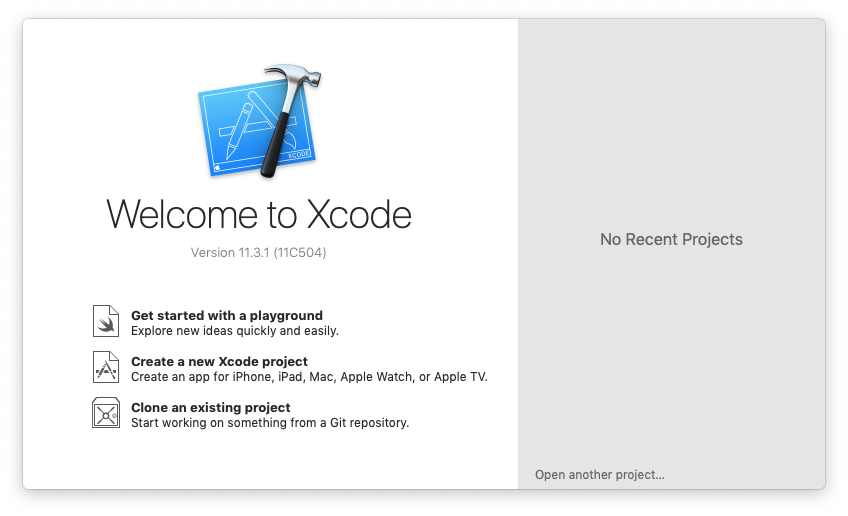
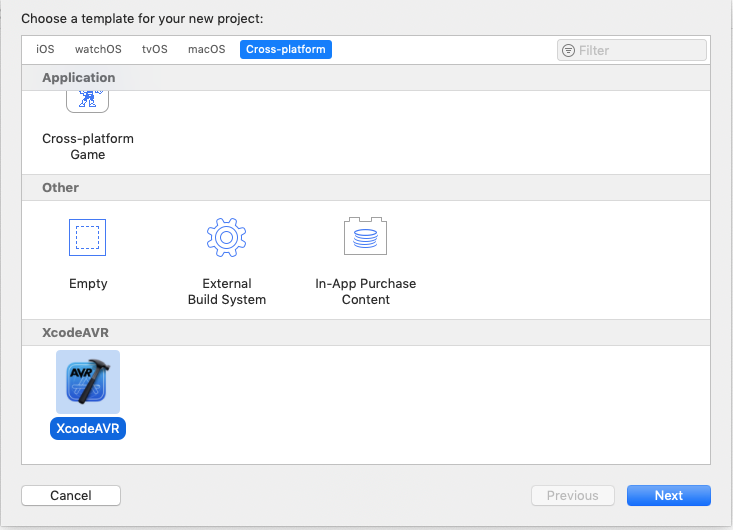
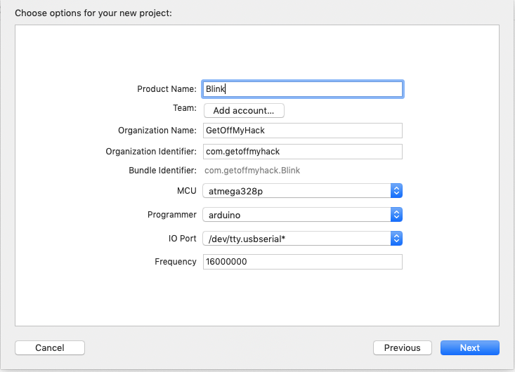

# XcodeAVR: An Xcode Project Template for AVR Development

!! This preliminary documentation is '*__alpha__*' quality.  I will be writing up a set of readmes that describes the template, the Makefile and skeleton AVR project in much more detail. !!

## Introduction

XcodeAVR is an Xcode project template that creates a working AVR build environment integrated into Xcode.  This will allow you to build, flash and do (limited) debugging from within Xcode.

Although this will work with Arduino boards using the Arduino bootloader, this is __*NOT*__ an Arduino development environment and does not use nor need anything related to the Arduino tool chain and its libraries.

The accompanying Makefile was built to work stand-alone from the command line as well as integrated in the Xcode project template.

This is a work in progress as there are many additions that are needed in order to make a full featured AVR build environment.

## Prerequisites

There are a few requirements needed for this project template to install and to properly function.

* __avr-gcc__       -- the AVR gcc compiler
* __avr-binutils__  -- the AVR binutils
* __avr-libc__      -- the C standard library for AVR targets
* __avrdude__       -- flash the code to the AVR target
* __minicom__       -- my preferred terminal emulator, used for serial debugging

There are many different ways to install the required tools, I prefer [Mac Ports](https://www.macports.org/).  With Mac Ports installed:

```
% sudo port install avr-gcc       # installs avr-binutils as a dependency
% sudo port install avr-libc
% sudo port install avrdude
% sudo port install minicom
```


## XCode

I am currently using this with Xcode version 11.3.1.

## Installation

After cloning this repository into a local directory on your computer, `cd` to that directory and execute the setup script `XcodeAVR_setup`.

```
[~] % git clone https://github.com/getoffmyhack/XcodeAVR.git XcodeAVR
[~] % cd XcodeAVR
[~/XcodeAVR] % ./XcodeAVR_setup
```

This will attempt to locate the AVR tools, create a TemplateInfo.plist file and copy all the needed files to your local Xcode template directory.

This is a very simple PERL script and does very little error checking.  As long as the AVR tools are all installed, it should successfully work.

## Usage

Usage is straight forward as any project template in Xcode.

1. Launch Xcode and `Create a new Xcode Project`:



2. Select the `Cross-platform` templates then select `XcodeAVR`:



3. Choose the Project Options.  This is where you select the target `MCU`, the connected `Programmer`, the programmer's `IO Port` and the MCU's clock `Frequency`.




This will create a fully functional skeleton AVR project that can be compiled and flashed on the target MCU.  The project with it's Makefile can also be used directly from the command line as well as its integrated features with Xcode.

## Build Targets

The following build targets are available within Xcode as well as from the command line, for example: 
```
% make build flash
```

* __Build__ -- The default target that compiles all source files and links all object files creating a flashable binary file.

* __Flash__ -- Flashes the project binary to the target MCU.

* __Clean__ -- Removes all build generated intermediate and final binary files.

* __Serial__ -- Launches a serial terminal using `minicom` and connects to configured serial port.

* __All__ -- __*Build*__, __*Flash*__ and __*Serial*__


## Links
* Inspired by the [xavr](https://github.com/jawher/xavr) repo.
* [avr-libc](https://www.nongnu.org/avr-libc/)
* [avr-gcc](https://gcc.gnu.org/wiki/avr-gcc)
* [avrdude](https://www.nongnu.org/avrdude/)
* [minicom](https://salsa.debian.org/minicom-team/minicom)
* [Mac Ports](https://www.macports.org/)